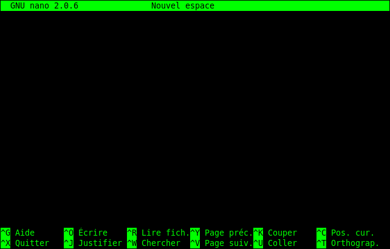
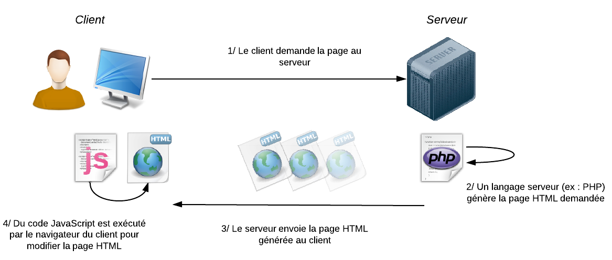

# Linux stuff & web

## Console linux

❓ Pour n'importe quelle commande linux il existe une documentation complète accessible en local depuis la console via la commande `man`:

```bash
man sudo # Affiche la documentation de la commande 'sudo'
```

### Droits administrateurs (sudo) & permissions

- Utilisateur "normal": peut modifier du contenu dans ses dossiers, même à travers des ressources ou programmes

- Super utilisateur: peut modifier n'importe quel contenu de l'ordinateur depuis la racine

La ressource `sudo` permet d'éxecuter une commande en tant que super utilisateur (sudo = SuperDo), par exemple l'installation ou mise à jour de paquets:

```bash
apt-get update
# W: chmod 0700 of directory /var/lib/apt/lists/partial failed - SetupAPTPartialDirectory (1: Opération non permise)
# E: Impossible d'ouvrir le fichier verrou /var/lib/apt/lists/lock - open (13: Permission non accordée)
# E: Impossible de verrouiller le répertoire /var/lib/apt/lists/
# W: Problème de suppression du lien /var/cache/apt/pkgcache.bin - RemoveCaches (13: Permission non accordée)
# W: Problème de suppression du lien /var/cache/apt/srcpkgcache.bin - RemoveCaches (13: Permission non accordée)
```

```bash
sudo apt-get update
# S'éxecute sans erreur
```

L'équivalent pour les logiciels graphiques est `gksudo` (ou `kdesudo` sur un environnement KDE)

Outre ce système, linux utilise un système de permissions pour gérer ce que les utilisateurs et ressources internes et externes (un programme - tel php par exemple) peuvent ou ne peuvent pas faire. C'est assez complet donc je vous invite à regarder par ici  [https://doc.ubuntu-fr.org/permissions](https://doc.ubuntu-fr.org/permissions)

### Commandes basiques (cd, cp, rm, ...)

```bash
cd dossier # Permet de se dépacer dans un dossier
```

```bash
ls # Permet de lister un répertoire
ls dossier # Liste le répertoire "dossier"
ls -a # Liste tous les fichiers, même ceux cachés
ls -al # Liste tous les fichiers, de manière detaillé
```

```bash
mkdir dossier # Créer le répertoire "dossier"
```

```bash
wget https://lien/vers/un/fichier # Télécharge un fichier dans le dossier actuel
```

```bash
cp source destination # Copie le fichier "source" vers "destination"
cp -R source destination # Copier le dossier "source" vers "destination"
```

```bash
mv source destination # Déplace le fichier "source" vers "destination"
```

```bash
rm fichier # Supprime le fichier "fichier"
rm -Rf dossier # Supprime un dossier
# ATTENTION : Avec la commande "rm" il n'y a pas de mise à la corbeille, c'est une supression totale, à utiliser minucieusement, surtout en sudo...
```

**Note**: N'oubliez pas le manuel: `man` !

Quelques petits truc sur les dossies et "chemins":

- `/` est la racine de l'ordinateur (ou plutôt la partition), c'est l'équivalent du `C:/` sur Windows
- `/home/nomd'utilisateur/` est votre dossier personnel, vous pouvez utiliser `~` comme raccourci pour le cibler (ex: `cd ~/Documents` améne vers vos documents)
- `/etc/` contient généralement les fichiers de configuration de programmes
- `/media/` contient l'accés aux périphériques (clé USB, partitions secondaires, CD, ...)

### Gestionnaire de paquet (apt-get)

```bash
sudo apt-get install paquet # Installe un paquet
sudo apt-get install paquet -y # Installe un paquet sans demander de confirmation
```

```bash
sudo apt-get update # Mets à jour la liste des paquets
sudo apt-get upgrade # Mets à jour les paquets qui ne sont pas à jour (version_paquet < version_dans_la_liste)
sudo apt-get dist-upgrade # Mets à jour les paquets système (le "noyeau")
# L'option -y peut être utiliser ici aussi
```

```bash
sudo apt-get remove paquet # Supprime "normalement" un paquet
sudo apt-get remove paquet --purge # Supprime un paquet et purge la majorité de ses fichiers
sudo apt-get autoremove # Supprime les paquets devenus innutiles
sudo apt-get autoremove --purge paquet # Combot ultime pour désinstaller complétement un paquet et laisser le moins de résidus possible
```

**Note**: Les mises à jours et installations nécessites une connection internet (obvious)

### Nano, l'éditeur de texte de la console



```bash
nano fichier # Edite un fichier
```

```bash
sudo nano fichier # Edite un fichier avec les droits administrateurs
```

## Serveur web

### Fonctionnement & explications



- **Apache**: Programme qui va gérer le serveur *http*, accessible via l'adresse: [http://localhost](http://localhost) en local sur **la machine**
- **PHP**: Language qui va générer une page *HTML* pour la renvoyer au serveur *apache* qui la renvoie au *client*
- **MySQL**: Base de donnée avec laquelle *PHP* va communiquer

### Configuration apache

> /etc/apache2/apache2.conf

[apache2.conf](apache2.conf)

> /etc/apache2/sites-enabled/000-default.conf

[000-default.conf](000-default.conf)

Modifier les permissions:

```bash
sudo chown $(whoami):www-data /var/www -R
```

### Installation de wordpress

```bash
sudo ln -s /usr/share/phpmyadmin /var/www/phpmyadmin
```

Se connecter sur phpmyadmin (identifiant: root, mot de passe: choit lors de l'installation) et créer la  base de donnée "wordpress"

`>>` http://localhost/phpmyadmin/

```bash
cd ~ # On se rend dans le dossier ou se trouve l'archive de wordpress
tar zxvf latest.tar.gz # On extrait l'archive
sudo mv wordpress /var/www/wordpress # On déplace le dossier wordpress dans notre répertoire serveur
# Il vaudrait même mieux le mettre dans ~/www
sudo service apache2 restart
```

Suivre les étapes (identifiant et mot de passe comme précédement pour la base de donnée)

`>>` http://localhost/wordpress

Pour le fichier de configuration wordpress, copier le texte donné puis:

```bash
sudo nano /var/www/wordpress/wp-config.php # Coller le code copié ici
```

Puis ensuite la reste est à vous ;)
